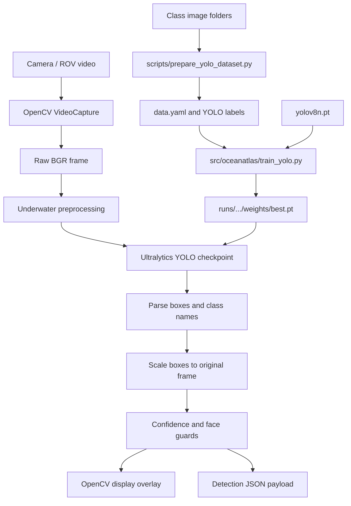

# OceanAtlas Project Architecture

## 1. Purpose

OceanAtlas is a Python 3.11 computer-vision project for real-time underwater deposit detection. The active production path captures frames with OpenCV, applies underwater image preprocessing, runs an Ultralytics YOLO detector, draws a live overlay, and emits JSON detections for a backend or ROV stream.

The detector is configured for exactly three classes:

1. `polymetallic_nodules`
2. `cobalt_rich_crust`
3. `hydrothermal_sulphide`

The old feature-based Random Forest classifier remains in the repository as a compatibility path, but it is not the active live YOLO path.

## 2. System Boundary

### Inputs

- USB, laptop, or ROV camera through OpenCV `VideoCapture`.
- Class-organized training images under `dataset/`.
- Optional YOLO checkpoint, normally `runs/detect/runs/detect-3/weights/best.pt`.

### Processing

- BGR frame capture.
- Gray-world color correction.
- LAB contrast enhancement with CLAHE.
- Color denoising.
- Resize to YOLO inference dimensions.
- YOLO inference and confidence filtering.
- Bounding-box coordinate conversion back to the original frame.
- Strongest-detection selection for the current full-image-label dataset.
- Face rejection guard for the live camera path.

### Outputs

- OpenCV window named `OceanAtlas YOLO detector`.
- Bounding box, class name, and confidence overlay.
- `No deposit detected` overlay when no accepted detection exists.
- JSON payload printed to stdout for stream/backend integration.

## 3. High-Level Architecture



## 4. Runtime Flow

1. `src/oceanatlas/live_pipeline.py` parses CLI arguments.
2. The default model path is `runs/detect/runs/detect-3/weights/best.pt`, unless `--model-path` is supplied.
3. `YOLODetector` loads the checkpoint.
4. OpenCV opens the requested camera index.
5. Each frame is copied for display and sent to `YOLODetector.detect()`.
6. `YOLODetector.detect()` applies `preprocess_frame(frame, resize_shape=(640, 640))` and invokes Ultralytics YOLO on CPU by default.
7. `YOLODetector.parse_results()` maps numeric class IDs to the three approved class names.
8. Bounding boxes are scaled from the processed inference frame to the original camera frame.
9. The live loop keeps the strongest candidate to prevent box flooding caused by the current full-image labels.
10. Near-full-frame boxes from legacy checkpoints are rejected using `max_box_area_ratio`; this is a reliability guard, not an accuracy substitute.
11. The face guard rejects only a detection whose bounding box overlaps a detected human face; deposits elsewhere in the frame remain eligible.
11. Accepted detections are drawn on the display and emitted as JSON.
12. The loop stops when the camera ends or the user presses `q`.

## 5. Training Flow

1. Source images are stored in class folders under `dataset/`.
2. `scripts/prepare_yolo_dataset.py` reads the three supported source folders.
3. The source folder `dataset/hydrothermal_sulphides` is mapped to the model class name `hydrothermal_sulphide`.
4. `dataset/plain_sediment_unclassified` is intentionally ignored.
5. Images are deterministically shuffled with seed `42`.
6. Approximately 80 percent of images go to `images/train`; the remainder go to `images/val`.
7. A matching object-level YOLO label file is required for every image, with one line per object.
8. Missing labels, invalid normalized coordinates, and the old full-image fallback annotation are rejected.
9. A capture-session manifest assigns complete sessions to train, validation, or test; session leakage is rejected.
10. `dataset/underwater_yolo/data.yaml` declares the dataset root and train/validation/test paths.
11. `scripts/augment_underwater.py` creates deterministic brightness, contrast, color-shift, blur, noise, visibility, scale-compatible, and horizontal-flip augmentations. Flipped labels are corrected.
12. `src/oceanatlas/train_yolo.py` loads `yolov8n.pt`, applies conservative underwater-compatible augmentation, uses AdamW, validation, and early stopping.
13. The best and last checkpoints are written under `runs/detect/`.

### Existing historical training artifact

- Checkpoint: `runs/detect/runs/detect-3/weights/best.pt`
- Training configuration: `runs/detect/runs/detect-3/args.yaml`
- Base checkpoint: `yolov8n.pt`
- Python: `3.11.9`
- Ultralytics: `8.4.143`
- Training device: CPU
- Training run: 50 epochs, image size 640
- This checkpoint was trained before annotation enforcement and must not be treated as the final accuracy result.
- A new production checkpoint can only be created after object-level labels, session assignments, and held-out test scenes are supplied.

The historical checkpoint was verified to contain:

```text
{0: 'polymetallic_nodules', 1: 'cobalt_rich_crust', 2: 'hydrothermal_sulphide'}
```

## 6. File-by-File Architecture

### Root configuration and documentation

#### `README.md`

Project-level usage documentation. Describes the three-class YOLO architecture, annotation format, training command, live command, JSON-oriented runtime behavior, and the need for real object-level annotations.

#### `ARCHITECTURE.md`

This document. It is the consolidated architecture reference for the project.

#### `pyproject.toml`

Defines the installable Python package:

- Package name: `oceanatlas`
- Version: `0.1.0`
- Supported Python: `>=3.11,<3.13`
- Source package directory: `src`
- Build backend: setuptools

Editable installation makes `python -m oceanatlas...` work from the project root without manually setting `PYTHONPATH`.

#### `requirements.txt`

Runtime and development dependencies:

- `numpy>=1.24.0`
- `opencv-python==4.10.0.84`
- `scikit-image>=0.22.0`
- `scikit-learn>=1.3.0`
- `matplotlib>=3.7.0`
- `joblib>=1.3.0`
- `pytest>=7.0.0`
- `pandas>=2.0.0`
- `ultralytics>=8.2.0`

OpenCV is pinned to 4.10 because the installed OpenCV 5 build did not expose `cv2.CascadeClassifier`, which is used by the live face-rejection guard.

#### `pytest.ini`

Adds `src` to the pytest import path so tests can import `oceanatlas` without a separate environment variable.

### Python package: `src/oceanatlas/`

#### `__init__.py`

Public package exports. Exposes preprocessing, legacy feature/classifier APIs, YOLO class names, the YOLO detector, and the detection-payload builder.

#### `preprocessing.py`

Shared image preprocessing module.

Public functions:

- `apply_underwater_color_correction(frame_bgr)`
- `preprocess_frame(frame, resize_shape=(224, 224))`

Processing stages:

1. Copy and normalize input shape.
2. Gray-world color correction.
3. Convert to LAB.
4. Apply CLAHE to luminance.
5. Convert back to BGR.
6. Apply colored non-local means denoising.
7. Resize to the requested output size.

YOLO inference calls this module with `(640, 640)`.

#### `yolo_pipeline.py`

Active detector abstraction and JSON payload construction.

Important symbols:

- `YOLO_CLASS_NAMES`: canonical class ordering.
- `build_detection_payload()`: creates the JSON envelope.
- `YOLODetector.__init__()`: stores device, threshold, and model path.
- `YOLODetector._load_model()`: loads a local `.pt` checkpoint or fallback `yolov8n.pt`.
- `YOLODetector.detect()`: preprocesses and performs inference.
- `YOLODetector.parse_results()`: converts Ultralytics boxes into project dictionaries and rescales coordinates.
- `YOLODetector.detect_and_package()`: combines inference, parsing, filtering, and JSON packaging.

Detection object shape:

```json
{
  "class": "polymetallic_nodules",
  "confidence": 0.88,
  "bbox": [10, 20, 300, 250]
}
```

#### `live_pipeline.py`

Active camera application.

Important symbols:

- `_safe_imshow()`: prevents GUI errors from crashing the loop.
- `_safe_wait_key()`: safe keyboard polling.
- `_contains_face()`: OpenCV Haar-cascade face rejection guard with compatibility fallback.
- `run_live_pipeline()`: capture, inference, filtering, overlay, JSON emission, and cleanup.

CLI options:

- `--camera-index`: OpenCV camera index, default `0`.
- `--model-path`: local YOLO `.pt` checkpoint.
- `--confidence`: minimum confidence, default `0.05`.
- `--dataset-dir`: deprecated compatibility option.
- `--vote-window`: deprecated compatibility option.

#### `train_yolo.py`

YOLO training entry point.

Public function:

- `train_yolo(data_yaml, model='yolov8n.pt', epochs=80, imgsz=640)`

The CLI delegates to Ultralytics `YOLO.train()` with AdamW, a conservative learning rate, underwater-compatible HSV/scale/flip/mosaic/mixup settings, validation, patience-based early stopping, and `project='runs'`/`name='detect'`. Ultralytics automatically increments the run directory when previous runs exist. YOLOv8n is retained because the validated environment trains on CPU; a larger checkpoint should only be selected after hardware and validation checks.

#### `dataset.py`

Dataset organization and legacy feature-store support.

Important symbols:

- `CLASS_NAMES`: three-class source-folder contract.
- `ensure_dataset_structure()`: creates the three class directories.
- `collect_dataset_images()`: loads class-folder images.
- `build_feature_store()`: creates NumPy feature arrays and optional `.npz` output.
- `save_dataset_manifest()`: writes a JSON manifest of source images.

This module supports the older feature-based classifier and is not the YOLO annotation builder.

#### `capture_dataset.py`

Camera capture utility for collecting more source images.

Workflow:

- Opens camera index.
- Displays the live image.
- Press `s` to save a frame into the selected class folder.
- Press `q` to quit.

CLI arguments include dataset root, class name, camera index, and maximum image count.

#### `features.py`

Legacy handcrafted feature extraction path.

Feature groups:

- HSV histogram.
- Local binary pattern histogram.
- Gradient magnitude and entropy.
- Contour area, perimeter, circularity, count, and edge density.
- Canny edge density.
- Luminance standard deviation.

Also contains `build_visual_payload()` for the older class-level visual response messages.

#### `model.py`

Legacy Random Forest classifier compatibility layer.

Important symbols:

- `CLASS_NAMES`
- `OceanVisionClassifier`
- `train_classifier()`
- `evaluate_classifier()`
- `classify_frame()`
- `train_and_split()`
- `save_metrics_json()`

This path serializes models with joblib. `models/oceanvision.joblib` belongs to this path and must not be passed to `live_pipeline.py`, which expects a YOLO `.pt` checkpoint.

#### `realtime.py`

Older real-time helper functions:

- `detect_sample_presence()`: threshold and contour-based sample presence detection.
- `majority_vote_label()`: majority vote over labels.
- `build_sample_region()`: crops a supplied bounding box.

The current YOLO live pipeline does not use these functions directly, but they remain available for compatibility and future orchestration.

#### `yolo_pipeline.py` temporal support

`TemporalDetectionSmoother` requires repeated agreement on class and bounding-box IoU before a detection is accepted. The default live settings require three consecutive frames with IoU of at least `0.4`.

#### `process_dataset.py`

Dataset-processing utility present in the package. It belongs to the earlier dataset/feature workflow and should be treated as compatibility code unless explicitly wired into a command.

### Scripts

#### `scripts/prepare_yolo_dataset.py`

Converts class-folder images into the YOLO directory layout:

```text
dataset/underwater_yolo/
  data.yaml
  images/train/
  images/val/
  labels/train/
  labels/val/
```

It maps the plural hydrothermal source folder to the singular model class, includes configured negative folders with empty labels, rejects missing or fabricated labels, and ignores no configured negative folder. It requires `--manifest` with `image,session,split` columns.

#### `scripts/annotate_yolo.py`

OpenCV-only manual annotation workflow. It displays each source image, lets the user choose one of the three canonical classes, draws one box per object, and writes normalized YOLO labels. It does not infer or invent boxes.

#### `scripts/augment_underwater.py`

Creates deterministic training-only variants with brightness/contrast changes, color shifts, blur, sensor noise, visibility degradation, valid horizontal flips, and label-aware box changes. `--balance` augments underrepresented labeled classes toward the largest class.

#### `scripts/evaluate_yolo.py`

Runs Ultralytics validation on the held-out `test` split and prints aggregate precision, recall, mAP50, mAP50-95, per-class values, and the confusion-matrix path.

#### `scripts/compare_preprocessing.py`

Evaluates the same checkpoint on raw and underwater-preprocessed copies of the held-out test set. The raw/preprocessed result must be compared before enabling `--underwater-preprocess` in live inference.

#### `scripts/verify_yolo_model.py`

Prints checkpoint path, task, class count, exact class mapping, confidence/IoU settings, and model overrides. It fails if the three canonical class IDs are not exact.

#### `scripts/validate_yolo_dataset.py`

Checks image-label pairs, missing files, corrupted images, duplicate image hashes, class IDs, normalized coordinates, and zero-sized boxes.

#### `scripts/diagnose_yolo_image.py`

Runs a known image through YOLO at a low diagnostic threshold, prints raw predictions before filtering, then prints predictions accepted at the configured threshold.

#### `scripts/compare_yolo_models.py`

Evaluates preserved YOLO checkpoints on exactly the same validation or held-out test split.

### Tests

#### `tests/test_pipeline.py`

Covers:

- Preprocessing output shape and range.
- Feature-vector extraction.
- Three-class visual payload behavior.
- Empty-frame sample detection.
- Majority voting.
- GUI failure fallback.
- Three-class YOLO payload schema.

#### `tests/test_dataset_store.py`

Covers:

- Creation of the three dataset class folders.
- Feature-store creation from sample images.
- Feature and label counts.
- Presence of all three labels.

Current validation result:

```text
9 passed
```

## 7. Dataset Architecture

### Source dataset

```text
dataset/
  polymetallic_nodules/
  cobalt_rich_crust/
  hydrothermal_sulphides/
  plain_sediment_unclassified/
  underwater_yolo/
```

The source folders are classification-style folders. They originally contain images but no per-object YOLO label files.

### Prepared YOLO dataset

```text
dataset/underwater_yolo/
  data.yaml
  images/
    train/
    val/
  labels/
    train/
    val/
```

`data.yaml`:

```yaml
path: dataset/underwater_yolo
train: images/train
val: images/val
names:
  0: polymetallic_nodules
  1: cobalt_rich_crust
  2: hydrothermal_sulphide
```

### Annotation limitation

The previous preparation script created one full-image bounding box per image. That behavior has been removed. The new script requires manual or tool-generated object-level labels. Without those labels, preparation intentionally fails rather than producing misleading metrics.

Object-level annotation quality remains essential. If labels are not manually reviewed, the following risks remain:

- Very low confidence thresholds produce false positives.
- A human face or unrelated object can be mistaken for a deposit when the camera domain differs from the training images.
- Proper CVAT, LabelImg, or Roboflow annotations are required for deployment-quality accuracy.

## 8. JSON Contract

The active payload has this structure:

```json
{
  "device_id": "ROV-3-CAM",
  "timestamp": "2026-09-08T00:00:00+00:00",
  "detections": [
    {
      "class": "polymetallic_nodules",
      "confidence": 0.88,
      "bbox": [10, 20, 300, 250]
    }
  ]
}
```

Rules:

- `device_id` defaults to `ROV-3-CAM`.
- `timestamp` is UTC ISO-8601.
- `detections` is always a list.
- `class` is limited to the three approved names.
- `confidence` is a floating-point model confidence.
- `bbox` is `[x, y, width, height]` in original-frame pixel coordinates.

## 9. Model Artifacts

### `yolov8n.pt`

Downloaded Ultralytics base checkpoint used for transfer learning and fallback inference.

### `runs/detect/runs/detect-2/`

Earlier 30-epoch training run.

### `runs/detect/runs/detect-3/`

Current 50-epoch training run. Contains:

- `args.yaml`: exact training configuration.
- `weights/best.pt`: best validation checkpoint used by live inference.
- `weights/last.pt`: final epoch checkpoint.
- Training plots and result files generated by Ultralytics.

### `models/oceanvision.joblib`

Legacy Random Forest classifier artifact. It is not compatible with the YOLO live detector.

## 10. Commands

### Activate environment

```powershell
.\.venv\Scripts\Activate.ps1
```

### Run tests

```powershell
python -m pytest -q
```

### Prepare YOLO data

```powershell
python scripts\prepare_yolo_dataset.py
```

### Train YOLO

```powershell
python -m oceanatlas.train_yolo `
  --data dataset\underwater_yolo\data.yaml `
  --model yolov8n.pt `
  --epochs 50 `
  --imgsz 640
```

### Run live detection

```powershell
python -m oceanatlas.live_pipeline `
  --camera-index 0 `
  --model-path runs\detect\runs\detect-3\weights\best.pt
```

Press `q` in the OpenCV window to stop.

## 11. Environment Architecture

The supported environment is:

- Windows.
- Python `3.11.9`.
- NumPy `2.4.6` in the validated environment.
- OpenCV `4.10.0`.
- Ultralytics `8.4.143`.
- CPU PyTorch runtime in the validated training environment.
- Editable `oceanatlas` package installation from the project root.

The project previously failed because a Python 3.14 NumPy binary was present inside a Python 3.11 environment. Recreating `.venv` under Python 3.11 resolved that mismatch.

## 12. Operational Failure Modes

| Failure | Cause | Current handling |
|---|---|---|
| `No module named oceanatlas` | `src` not installed or not on `PYTHONPATH` | `pyproject.toml` and editable install |
| NumPy `_multiarray_umath` error | Mixed Python 3.14 binary in Python 3.11 venv | Recreated Python 3.11 venv |
| YOLO model not found | Incorrect or missing `.pt` path | Explicit `--model-path`; default current checkpoint |
| OpenCV GUI error | Headless or unsupported GUI backend | Safe display/wait wrappers |
| `CascadeClassifier` missing | Incompatible OpenCV build | OpenCV 4.10 pin plus compatibility fallback |
| Human false positive | Weak model and very low confidence threshold | Default threshold `0.05` plus face rejection |
| Box flood | Many weak full-image candidates | Strongest candidate only in live loop |
| Incorrect box position | Inference and camera dimensions differ | Coordinate scaling in `parse_results()` |
| Low real-world accuracy | Small dataset and full-image labels | Requires object-level annotations and more varied ROV imagery |

## 13. Security and Reliability Notes

- Model paths are local filesystem paths and should be treated as configuration, not user-controlled input.
- The JSON output is printed to stdout; a backend adapter can consume one payload per detection frame.
- No network service or authentication layer exists in this repository.
- Camera access is local through OpenCV.
- Generated model files and training runs can be large and should be managed separately from source code if the project is versioned.
- Dataset provenance and image licensing should be tracked outside the code when external images are used.

## 14. Recommended Production Evolution

1. Replace full-image generated labels with manually reviewed bounding boxes.
2. Add negative examples: people, phones, rocks, sediment, equipment, and empty seabed.
3. Balance the number of images across all three classes.
4. Split by capture session, not only by random image, to prevent near-duplicate leakage.
5. Add a held-out test set from a different camera and lighting condition.
6. Tune the confidence threshold using a precision-recall curve instead of lowering it until detections appear.
7. The live pipeline now requires temporal class-and-box agreement across consecutive frames; tune `--stable-frames` and `--iou-threshold` using validation video.
8. Add automated inference tests for known positive and negative images.
9. Add a backend transport layer around the JSON payload if the ROV stream requires HTTP, WebSocket, MQTT, or another protocol.
10. Keep the legacy Random Forest path separate from the YOLO path until it is intentionally removed.

## 15. Current Architecture Verdict

The repository is structurally complete and runnable as a local YOLO/OpenCV prototype. The active path is:

```text
camera -> OpenCV -> preprocessing -> YOLO .pt checkpoint -> parsed three-class detection -> overlay + JSON
```

The environment and software architecture are functioning, and the tests pass. Both preserved checkpoints were trained from a very small dataset using full-image labels and are retained only as historical artifacts. On the known polymetallic image, the current checkpoint's top polymetallic confidence is `0.0152`, below the live threshold `0.05`; the previous checkpoint produces higher-confidence but wrong-class full-image predictions. The new pipeline deliberately refuses to train until real object-level labels and capture-session metadata exist, so no final precision, recall, mAP50, or mAP50-95 values are reported yet. Reporting metrics without those labels would be misleading.
